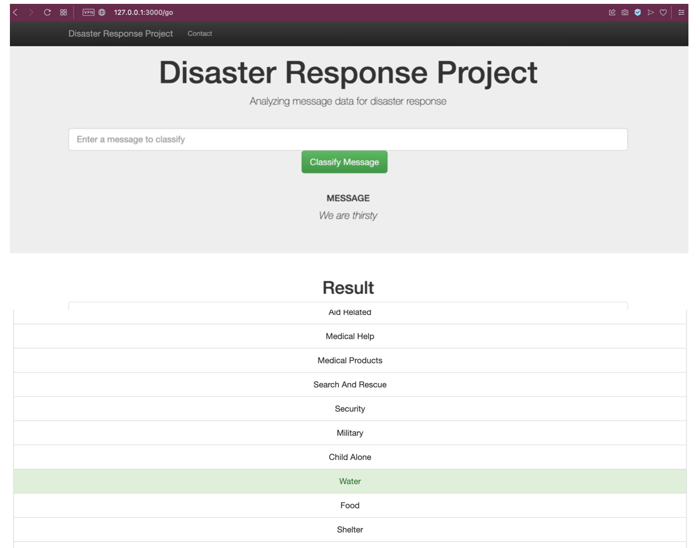

# Disaster response app

The present code presents an ETL and machine learning pipeline to categorize responses during a disaster. The dataset was provided by Figure Eight (now acquired by [Appen](https://appen.com), and contains pre-labeled tweets and text messages from real life disasters. This code cleans and reorganize the dataset to build a machine learning model. The model is able to tag a tweet or message with an appropriate response organization to help during an on-going disaster. During such threatening events, help organizations lacks the required capacity to filter the millions of tweets to focus on the real important ones. The machine learning model provided here can speed up the work on delivering medical supplies, water, or attending blocked roads.

## Quick start
Clone the repo: `git clone https://github.com/chinchay/disaster-response-app.git`

## How to use it

This code is organized in 3 directories:
* app/
    * `run.py`
    * templates/
        * `go.html`
        * `master.html`
* data/
    * `disaster_messages.csv`
    * `disaster_categories.csv`
    * `etl_pipeline.py`
* models/
    * `train_classifier.py`


### ETL pipeline

The code provided follows an ETL pipeline to clean and transform the `*.csv` files and load the results into a SQL database `*.db` by entering into the `data/` folder and typing the following:

```ShellSession
$ python etl_pipeline.py disaster_messages.csv disaster_categories.csv DisasterResponse.db
```

### Machine learning model

A machine learning model is saved as a `*.pkl` file to be used later by typing the following:

```ShellSession
$ cd ../models/
$ python train_classifier.py "../data/DisasterResponse.db" classifier.pkl
```

### Deployment

The `*.pkl` file created in the previous step is loaded by the application:

```ShellSession
$ python run.py
```

The model is working and ready for visualization on `http://127.0.0.1:3000` in your local machine.



**Fig 1**. App screenshot. The "We are thirsty" tweet is channeled to the appropriate aid organization.

## Copyright and license
Code released under the MIT License